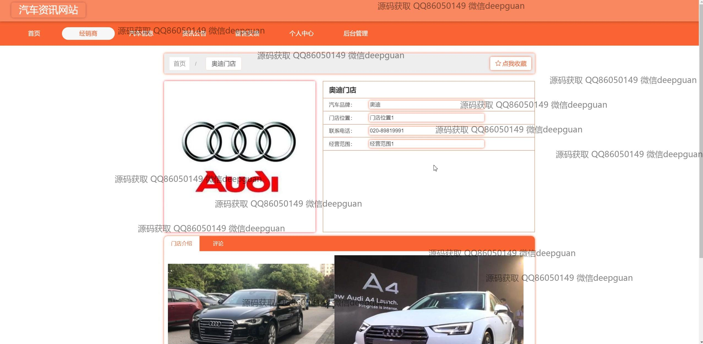

<h1 align="center">汽车资讯网站</h1>

## 简介
汽车资讯网站：基于Spring Boot开发，角色分为管理员和用户；包括用户管理、汽车品牌管理、资讯公告、价格分类管理、留言板管理等功能，设计简洁、功能明确，提升用户体验与管理效率。    --计算机毕业设计源码；毕设源码；java毕业设计源码

## 联系方式

<h3 align="center">获取完整代码与数据库文件 + 微信：deepguan QQ: 86050149 QQ群: 783742310</h3>

<h3 align="center">可帮忙远程部署 包运行成功！提供远程部署、修改代码、设计文档指导、代码讲解等服务！</h3>

## 功能介绍（完整见运行截图）
管理员：基本功能包括用户的添加、修改、删除和数据审核。网站首页支持信息发布和更新，如资讯公告、汽车信息和经销商管理。后台管理界面中可进行汽车品牌、价格分类、留言反馈及系统管理。管理员也可以通过搜索功能快速查找相关数据，实现对用户和网站信息的便捷管理与维护。

用户：基本功能涵盖注册、登录及个人资料管理。用户可通过网站主页浏览或搜索最新汽车资讯，访问车型推荐、经销商信息及最新公告。个人中心提供个人信息的查看与更新、头像上传，以及收藏管理等功能。用户在登录后还可以参与评论和留言，丰富用户意见和社群互动。

## 运行截图

本代码来源于网络,仅供学习参考使用!

